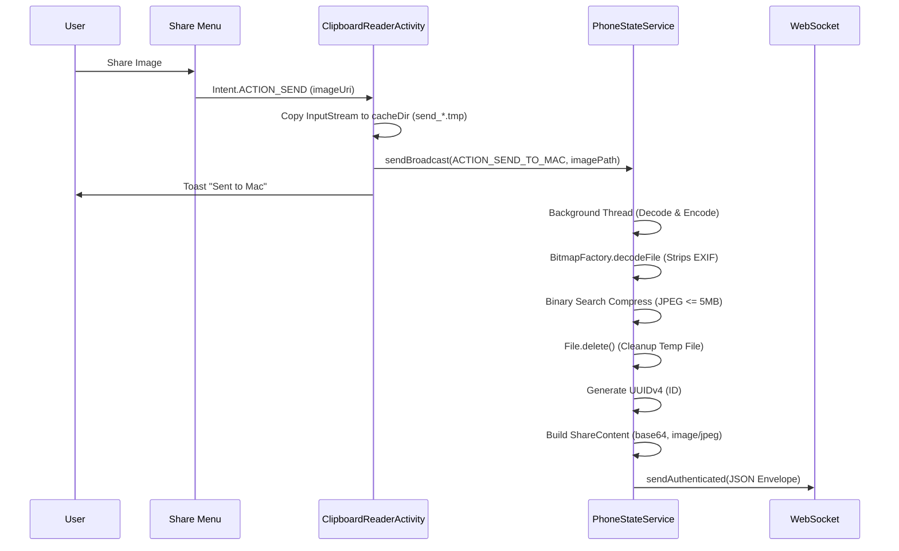

# Android Image Share Flow

```mermaid
sequenceDiagram
    participant User
    participant SystemShare as Share Menu
    participant ReaderActivity as ClipboardReaderActivity
    participant PhoneState as PhoneStateService
    participant WebSocket
    
    User->>SystemShare: Share Image
    SystemShare->>ReaderActivity: Intent.ACTION_SEND (imageUri)
    ReaderActivity->>ReaderActivity: Copy InputStream to cacheDir (send_*.tmp)
    ReaderActivity->>PhoneState: sendBroadcast(ACTION_SEND_TO_MAC, imagePath)
    ReaderActivity->>User: Toast "Sent to Mac"
    PhoneState->>PhoneState: Background Thread (Decode & Encode)
    PhoneState->>PhoneState: BitmapFactory.decodeFile (Strips EXIF)
    PhoneState->>PhoneState: Binary Search Compress (JPEG <= 5MB)
    PhoneState->>PhoneState: File.delete() (Cleanup Temp File)
    PhoneState->>PhoneState: Generate UUIDv4 (ID)
    PhoneState->>PhoneState: Build ShareContent (base64, image/jpeg)
    PhoneState->>WebSocket: sendAuthenticated(JSON Envelope)
```
