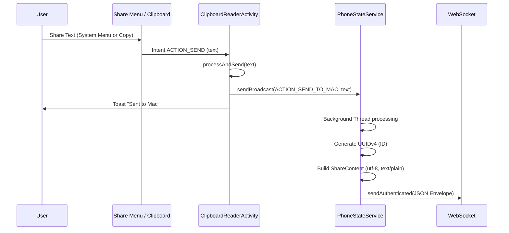

# Android Text Share Flow

```mermaid
sequenceDiagram
    participant User
    participant AndroidShare as Share Menu / Clipboard
    participant ReaderActivity as ClipboardReaderActivity
    participant PhoneState as PhoneStateService
    participant WebSocket
    
    User->>AndroidShare: Share Text (System Menu or Copy)
    AndroidShare->>ReaderActivity: Intent.ACTION_SEND (text)
    ReaderActivity->>ReaderActivity: processAndSend(text)
    ReaderActivity->>PhoneState: sendBroadcast(ACTION_SEND_TO_MAC, text)
    ReaderActivity->>User: Toast "Sent to Mac"
    PhoneState->>PhoneState: Background Thread processing
    PhoneState->>PhoneState: Generate UUIDv4 (ID)
    PhoneState->>PhoneState: Build ShareContent (utf-8, text/plain)
    PhoneState->>WebSocket: sendAuthenticated(JSON Envelope)
```
