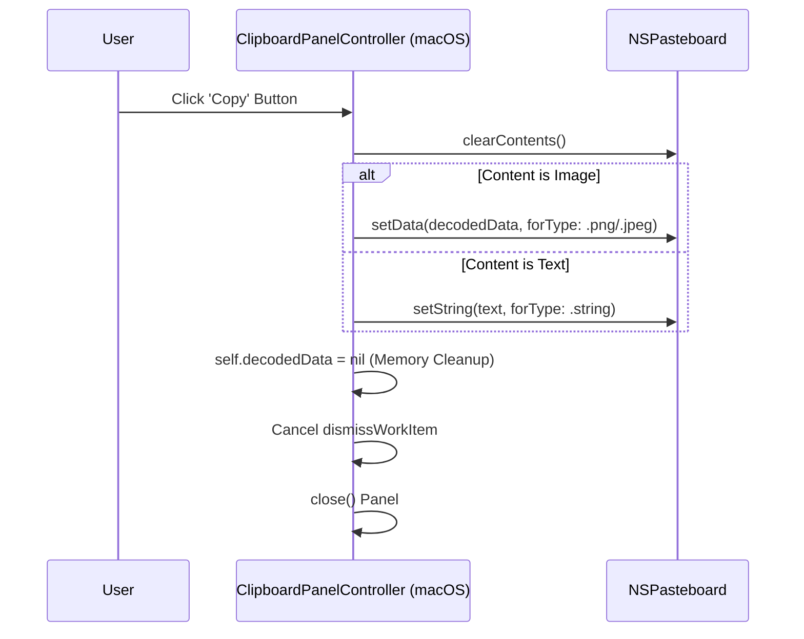

# Copy Button Lifecycle Flow

```mermaid
sequenceDiagram
    participant User
    participant Panel as ClipboardPanelController (macOS)
    participant Pasteboard as NSPasteboard
    
    User->>Panel: Click 'Copy' Button
    Panel->>Pasteboard: clearContents()
    
    alt Content is Image
        Panel->>Pasteboard: setData(decodedData, forType: .png/.jpeg)
    else Content is Text
        Panel->>Pasteboard: setString(text, forType: .string)
    end
    
    Panel->>Panel: self.decodedData = nil (Memory Cleanup)
    Panel->>Panel: Cancel dismissWorkItem
    Panel->>Panel: close() Panel
```
