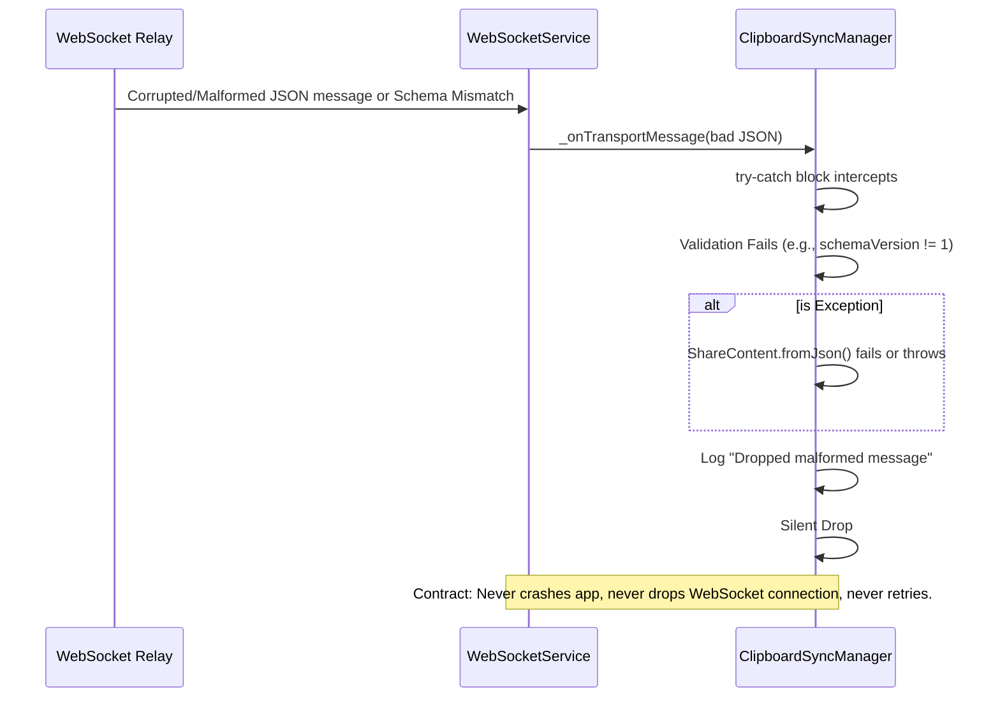

# Error Flow (Protocol Failure Contract)

```mermaid
sequenceDiagram
    participant Relay as WebSocket Relay
    participant WS as WebSocketService
    participant SyncManager as ClipboardSyncManager
    
    Relay->>WS: Corrupted/Malformed JSON message or Schema Mismatch
    WS->>SyncManager: _onTransportMessage(bad JSON)
    
    SyncManager->>SyncManager: try-catch block intercepts
    SyncManager->>SyncManager: Validation Fails (e.g., schemaVersion != 1)
    
    alt is Exception
        SyncManager->>SyncManager: ShareContent.fromJson() fails or throws
    end
    
    SyncManager->>SyncManager: Log "Dropped malformed message"
    SyncManager->>SyncManager: Silent Drop
    
    Note over WS, SyncManager: Contract: Never crashes app, never drops WebSocket connection, never retries.
```
