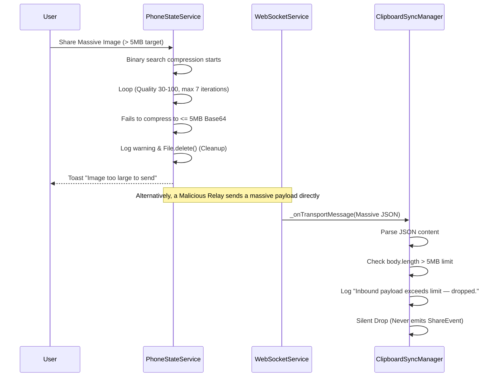

# Oversized Payload Flow

```mermaid
sequenceDiagram
    participant User
    participant Android as PhoneStateService
    participant WS as WebSocketService
    participant SyncManager as ClipboardSyncManager
    
    User->>Android: Share Massive Image (> 5MB target)
    Android->>Android: Binary search compression starts
    Android->>Android: Loop (Quality 30-100, max 7 iterations)
    Android->>Android: Fails to compress to <= 5MB Base64
    Android->>Android: Log warning & File.delete() (Cleanup)
    Android-->>User: Toast "Image too large to send"
    
    Note over Android, WS: Alternatively, a Malicious Relay sends a massive payload directly
    
    WS->>SyncManager: _onTransportMessage(Massive JSON)
    SyncManager->>SyncManager: Parse JSON content
    SyncManager->>SyncManager: Check body.length > 5MB limit
    SyncManager->>SyncManager: Log "Inbound payload exceeds limit — dropped."
    SyncManager->>SyncManager: Silent Drop (Never emits ShareEvent)
```
