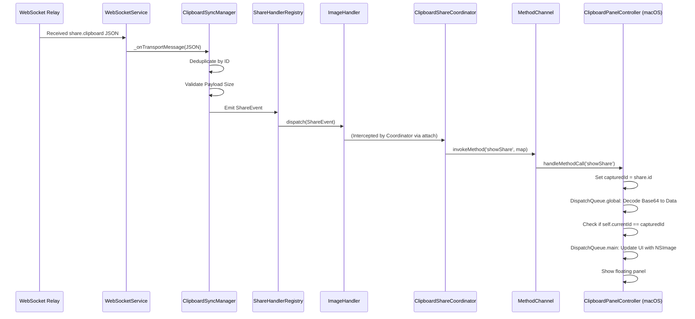

# macOS Popup Lifecycle Flow

```mermaid
sequenceDiagram
    participant Relay as WebSocket Relay
    participant WS as WebSocketService
    participant SyncManager as ClipboardSyncManager
    participant Registry as ShareHandlerRegistry
    participant Handler as ImageHandler
    participant Coordinator as ClipboardShareCoordinator
    participant Channel as MethodChannel
    participant Panel as ClipboardPanelController (macOS)
    
    Relay->>WS: Received share.clipboard JSON
    WS->>SyncManager: _onTransportMessage(JSON)
    SyncManager->>SyncManager: Deduplicate by ID
    SyncManager->>SyncManager: Validate Payload Size
    SyncManager->>Registry: Emit ShareEvent
    Registry->>Handler: dispatch(ShareEvent)
    Handler->>Coordinator: (Intercepted by Coordinator via attach)
    Coordinator->>Channel: invokeMethod('showShare', map)
    Channel->>Panel: handleMethodCall('showShare')
    Panel->>Panel: Set capturedId = share.id
    Panel->>Panel: DispatchQueue.global: Decode Base64 to Data
    Panel->>Panel: Check if self.currentId == capturedId
    Panel->>Panel: DispatchQueue.main: Update UI with NSImage
    Panel->>Panel: Show floating panel
```
