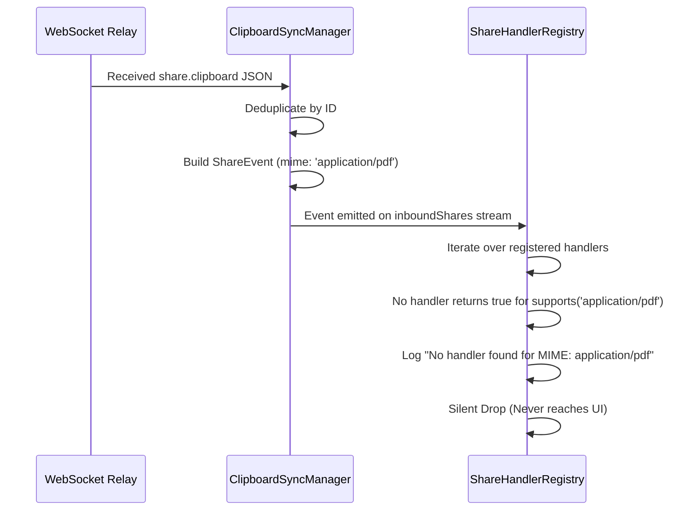

# Unsupported MIME Flow

```mermaid
sequenceDiagram
    participant Relay as WebSocket Relay
    participant SyncManager as ClipboardSyncManager
    participant Registry as ShareHandlerRegistry
    
    Relay->>SyncManager: Received share.clipboard JSON
    SyncManager->>SyncManager: Deduplicate by ID
    SyncManager->>SyncManager: Build ShareEvent (mime: 'application/pdf')
    SyncManager->>Registry: Event emitted on inboundShares stream
    Registry->>Registry: Iterate over registered handlers
    Registry->>Registry: No handler returns true for supports('application/pdf')
    Registry->>Registry: Log "No handler found for MIME: application/pdf"
    Registry->>Registry: Silent Drop (Never reaches UI)
```
